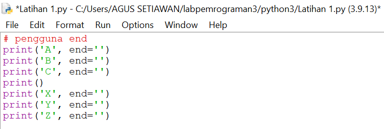

# TUGAS Praktikum 3
## Latihan 1

## penggunaan End
## - Penggunaan end di python fungsi nya untuk memberi pemisah atau parameter di antara quotes yang kita buat

## pengunaan separator
## - Pengunaan separotor di python sebagai pemisah di stiap variabel yang sudah diberi nilai

## String format
## - String format atau pemformatan string memungkinkan kita memasukan item ke dalam string atau bisa juga bisa menggabungkan string yang menggunakan koma atau string concatenation.

## Dan ini contohnya string concatenation

## - ini adalah contoh string formatting
## - ada 3 cara menggunakan string pemformatan string 
## - 1. Mode lama menggunakan placeholder atau menggunakan karakter %'(modulo)'
## - 2. teknik nya menggunakan metode string.format()
## - 3. metode terbaru yaitu dengan python 3.6 menggunakan string literal yang di format disebut *f-string*

# Latihan 2
