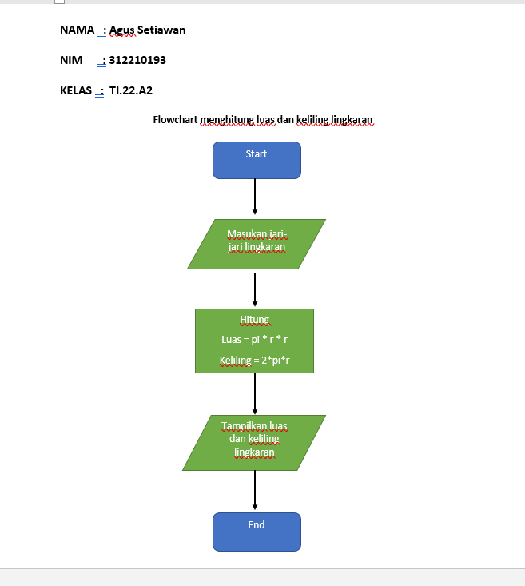
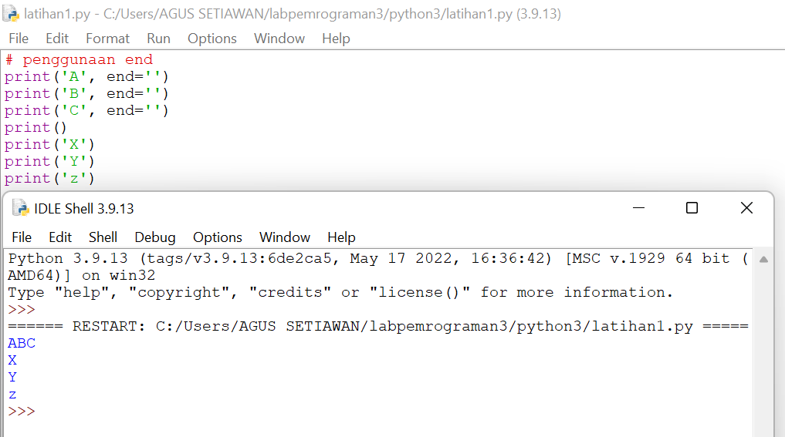
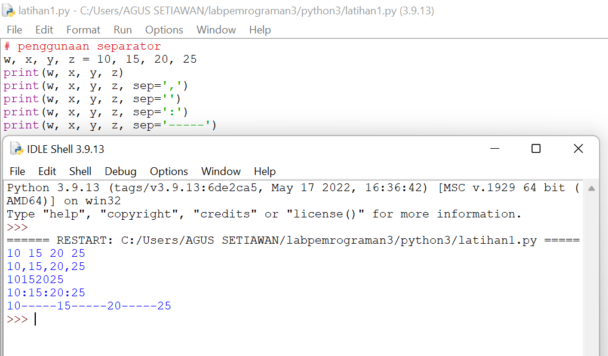
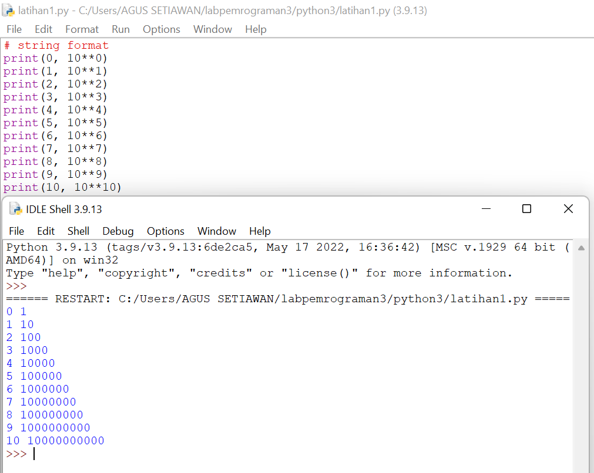
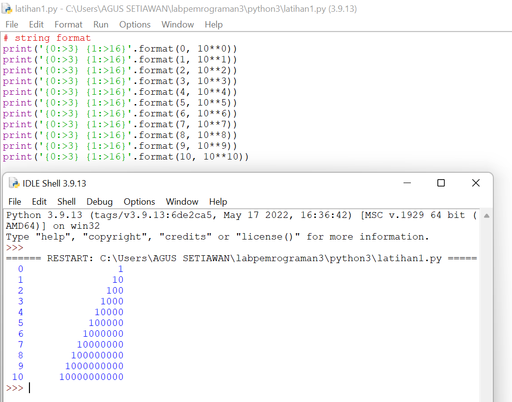
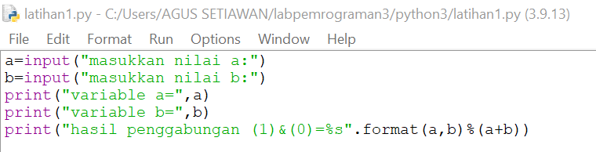
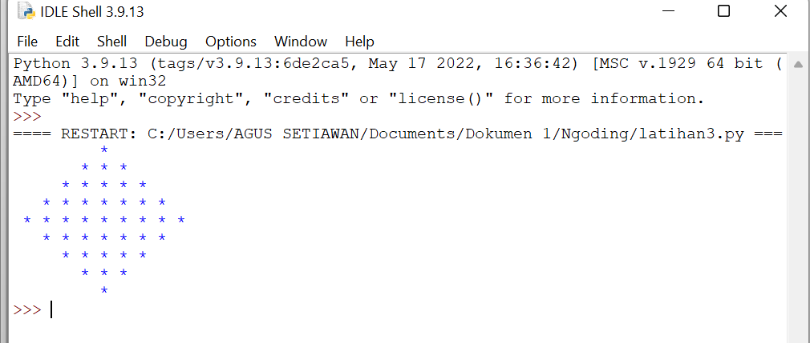
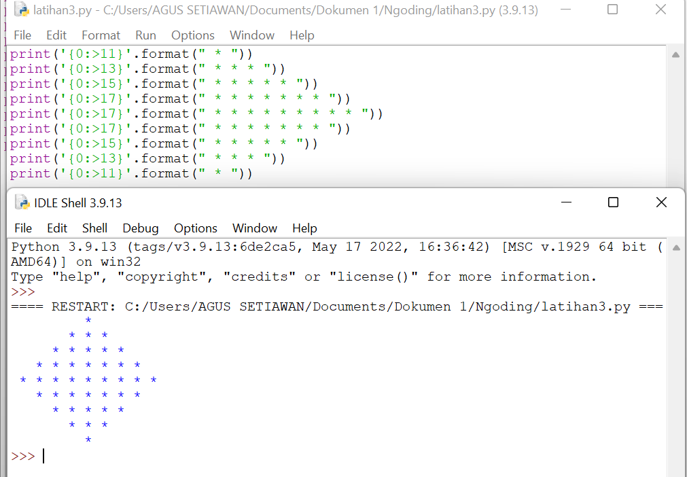

# TUGAS
# Praktikum 3

- Buatlah kode pemrograman untuk menghitung luas dan keliling lingkaran menggunakan python 

- flowchart menghitung luas dan keliling lingkaran 

# Latihan 1

## penggunaan End
## - Penggunaan end di python fungsi nya untuk memberi pemisah atau parameter di antara quotes yang kita buat

## pengunaan separator
## - Pengunaan separotor di python sebagai pemisah di stiap variabel yang sudah diberi nilai

## String format
## - String format atau pemformatan string memungkinkan kita memasukan item ke dalam string atau bisa juga bisa menggabungkan string yang menggunakan koma atau string concatenation.

## Dan ini contohnya string concatenation

## - ini adalah contoh string formatting
## Ada 3 cara menggunakan string pemformatan string 
## 1. Mode lama menggunakan placeholder atau menggunakan karakter %'(modulo)'
## 2. teknik nya menggunakan metode string.format()
## 3. metode terbaru yaitu dengan python 3.6 menggunakan string literal yang di format disebut *f-string*

# Latihan 2
## Tentukan variabel terlebih dahulu, kemudian memakai dua variabel , yaitu a dan b
## - input pada variabel
## - Setelah di input, ekspresikan variabel yang telah di input
## - Lalu gabungkan variabel a dan b dengan *format string* 

## Konversi nilai variabel
## - Konversi nilai variabel yang masih berbentuk 'string' pada integer
## - Setelah itu menjumlahkan dan membagi dengan mengepresikan dalam bentuk *formatting string*

# Latihan 3
## Buatlah kode pemrograman menggunakan string format untuk menghasilkan output seperti gambar di bawah ini

## - Agar melihat hasil output yang sama dengan Latihan 3 yaitu dengan menjalankan hasil dari statement yang sudah dibuat dan setelah itu di running

