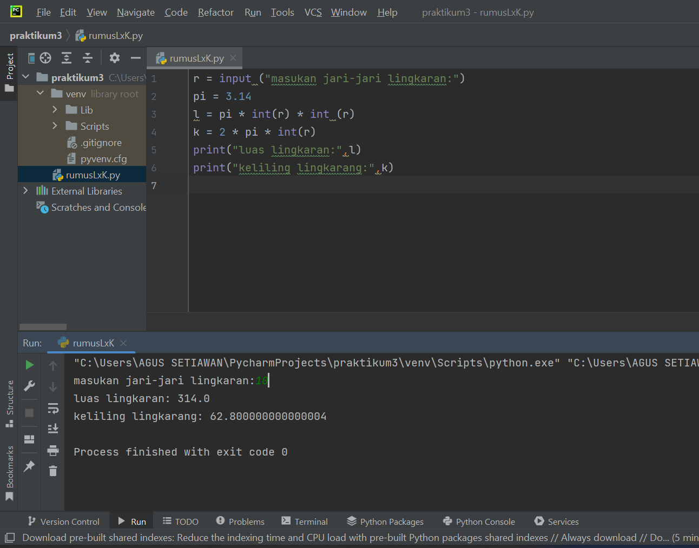

# TUGAS
# Praktikum 3

- Buatlah kode pemrograman untuk menghitung luas dan keliling lingkaran menggunakan python
##### - Masukan kode :
###### r = input ("masukan jari-jari lingkaran:")
###### pi = 3.14
###### l = pi * int(r) * int(r)
###### k = 2 * pi * int(r)
###### print("luas lingkaran:", l)
###### print("keliling lingkaran:", k)
#### - Setelah selesai masukan kode kemudian di running, akan diminta untuk *masukan angka* dan hasilnya akan ada seperti contoh gambar dibawah ini.

- Flowchart menghitung luas dan keliling lingkaran 

# Latihan 1

## Penggunaan End
- Penggunaan end di python fungsi nya untuk memberi pemisah atau parameter di antara quotes yang kita buat

## pengunaan separator
- Pengunaan separator di python sebagai pemisah di setiap variabel yang sudah diberi nilai

## String format
- String format atau pemformatan string memungkinkan kita memasukan item ke dalam string atau bisa juga bisa menggabungkan string yang menggunakan koma atau string concatenation.

#### - Dan ini contohnya string concatenation

#### - ini adalah contoh string formatting

# Latihan 2
- Tentukan variabel terlebih dahulu, kemudian memakai dua variabel , yaitu a dan b
#### - Input pada variabel
#### - Setelah di input, ekspresikan variabel yang telah di input
#### - Lalu gabungkan variabel a dan b dengan *format string* 

## Konversi nilai variabel
#### - Konversi nilai variabel yang masih berbentuk 'string' pada integer
#### - Setelah itu menjumlahkan dan membagi dengan mengepresikan dalam bentuk *formatting string*

# Latihan 3
## Buatlah kode pemrograman menggunakan string format untuk menghasilkan output seperti gambar di bawah ini

#### - Agar melihat hasil inputan yang sama dengan Latihan 3 yaitu dengan menjalankan hasil dari string format yang sudah dibuat dan setelah itu di running

# Terimakasih :)
